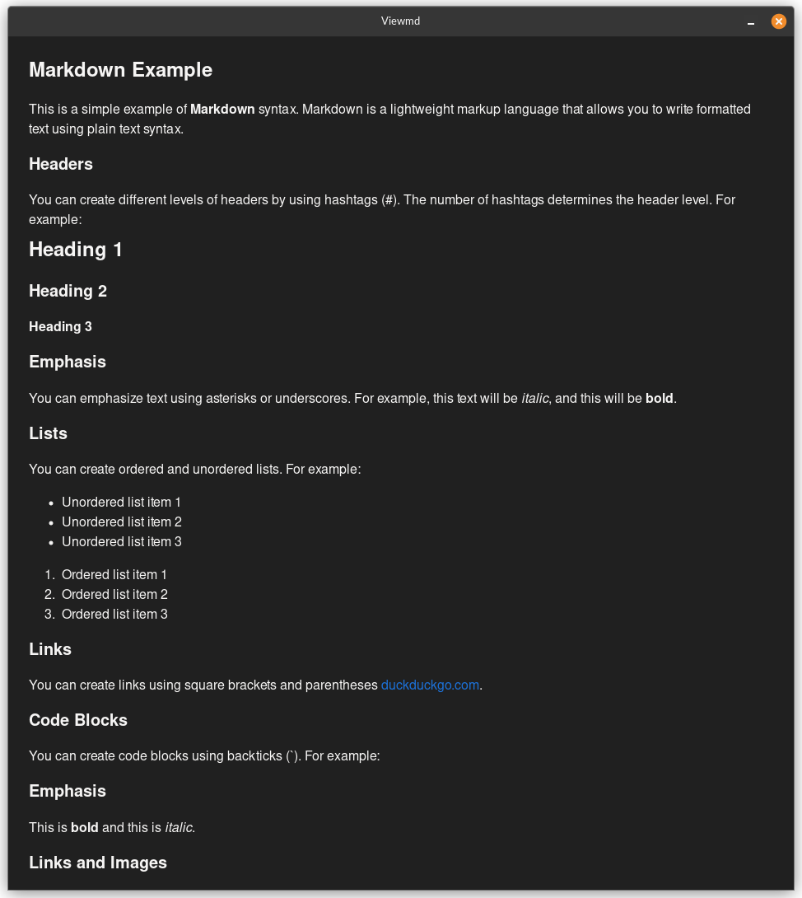

# viewmd



## Installation

### Quick Start

Users

```txt
git clone https://github.com/wilbura009/viewmd
cd viewmd && make install
```

Developers

```txt
git clone https://github.com/wilbura009/viewmd
cd viewmd && make install-dependencies && make run
```

Clones the repo., installs deps., compiles and runs `viewmd` with a test file.

### Dependencies

The project has the following dependencies:

- `make`
- `gcc`
- `pandoc`
- `pkg-config`
- `libgtk-3-dev`
- `libwebkit2gtk-4.1-dev`

Note: The makefile uses `apt` to install dependencies.

The makefile includes rules for a few types of installations.

* `make install-dependencies` -- Install only the dependencies, nothing else.
* `make install`              -- Install dependencies, compile project, and place the binary in `/usr/local/bin/`
* `make install-noroot`       -- Install dependencies, compile project, and place the binary in `$(HOME)/.bin`

## Uninstalling

* `make uninstall` -- Remove `/usr/local/bin/viewmd` and relevant .config files.
* `make uninstall-noroot` -- Remove `$(HOME)/.bin/viewmd` and relevant .config files.

## Usage

`viewmd [file_to_preview.md]`

Currently intended as a CLI tool for previewing markdown files.
Ideally, paired with [vim_viewmd](https://github.com/wilbura009/vim_viewmd),
or any other program that might call it while editing in another window.

After installation you may call `viewmd` from anywhere as seen above.

## Roadmap

See [Issues](https://github.com/wilbura009/vim_viewmd/issues)

## Contributing

See [Contributing](CONTRIBUTING.md)
